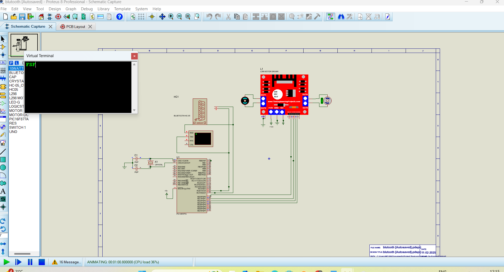

# BLUETOOTH-BASED-HOME-AUTOMATION-SYSTEM-USING-PIC16F877A
This project enables wireless control of a motor via Bluetooth using a PIC microcontroller. The microcontroller receives serial commands over Bluetooth and drives a motor in specific directions (forward, reverse, left, right) or stops it.

## Features
- **Bluetooth wireless control** (HC-05/HC-06 module or similar).
- Supported commands: **Forward (F)**, **Reverse (R)**, **Left (L)**, **Right (W)**, **Stop (S)**.
- Command echo for debugging via serial feedback.
- Configurable baud rate and hardware settings.

## Hardware Requirements
- PIC microcontroller (e.g., PIC16F877A)
- Bluetooth module (HC-05 or HC-06 recommended)
- Motor driver (e.g., L298N)
- Power supply for motor and microcontroller
- Mobile/PC with Bluetooth support

## Hardware Setup
### Pin Configuration
- **Motor Driver**:
  - `RD0` (IN1) → Motor driver input 1
  - `RD1` (IN2) → Motor driver input 2
  - `RD2` (IN3) → Motor driver input 3
  - `RD3` (IN4) → Motor driver input 4

- **Bluetooth Module**:
  - `RC6/TX` → Bluetooth module RX
  - `RC7/RX` → Bluetooth module TX
  - Connect `VCC` (3.3V-5V) and `GND` to power the module
## 🖼️ Preview Images

| Circuit Diagram | Configuration | Simulation |
|:---------:|:----------:|:---------:|
|  |  |  |

## Software Setup
1. **Bluetooth Configuration**:
   - Ensure Bluetooth module is set to **9600 baud** (default for this code).
   - Pair with your device using default PIN (usually `1234` or `0000`).

2. **Microcontroller Programming**:
   ```bash
   git clone https://github.com/mohsin1845/BLUETOOTH-BASED-HOME-AUTOMATION-SYSTEM-USING-PIC16F877A.git
- Open in MPLAB X IDE

- Compile with XC8 compiler

- Flash the HEX file to your PIC
## Power On:

- Connect motor driver and Bluetooth module to the PIC

- Power up the system

## Bluetooth Connection:

- On your phone/PC, pair with the Bluetooth module

- Use a serial terminal app (e.g., Serial Bluetooth Terminal for Android)

# Send Commands:
```
 F  → Forward
 R  → Reverse
 L  → Turn Left
 W  → Turn Right
 S  → Stop
```
- The PIC will echo received commands back for verification

# Configuration Notes
- Baud Rate: Code uses 9600 baud (set via SPBRG = 129 for 20MHz clock)

# Bluetooth Module:

- If using different baud rates, update both the code (SPBRG) and Bluetooth module (via AT commands)

- Default AT command sequence: AT+BAUD4 for 9600 baud

## Troubleshooting
**No Response:**

- Check Bluetooth module power (LED should blink slowly in pairing mode)

- Verify TX/RX connections are crossed (PIC TX → BT RX, PIC RX → BT TX)

**Incorrect Baud Rate:**

- Reconfigure Bluetooth module using AT commands

- Update SPBRG value in code for your clock frequency

# Dependencies
- MPLAB X IDE
- XC8 Compiler
- Bluetooth terminal app
